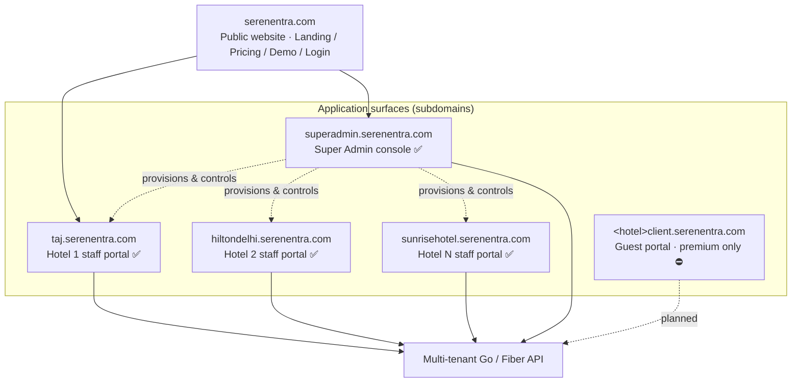
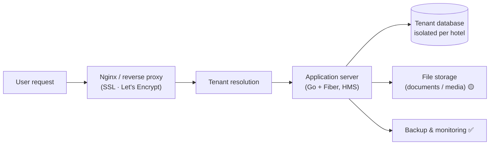
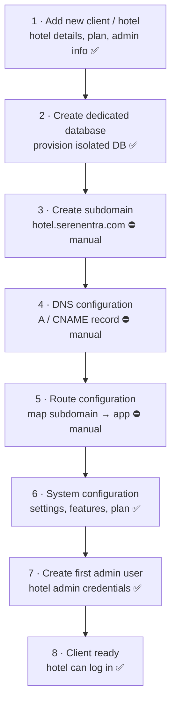
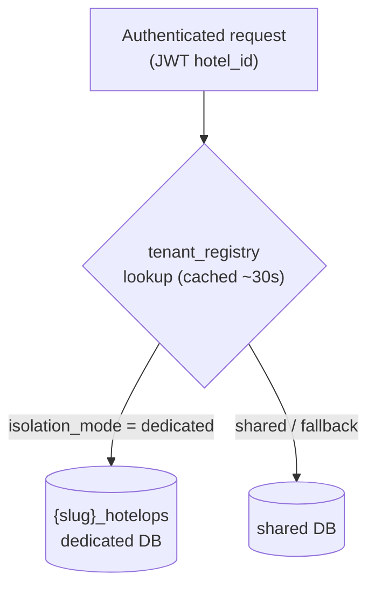
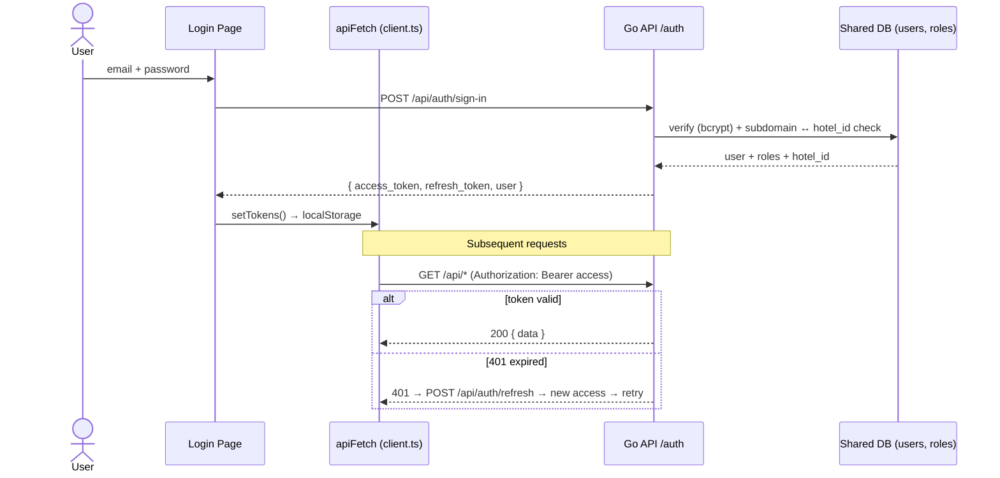
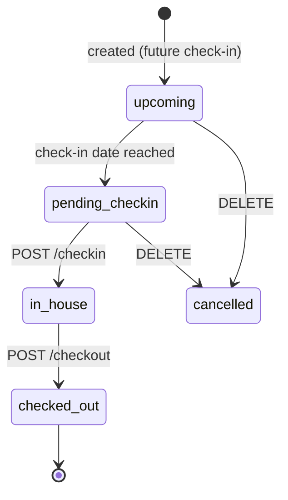
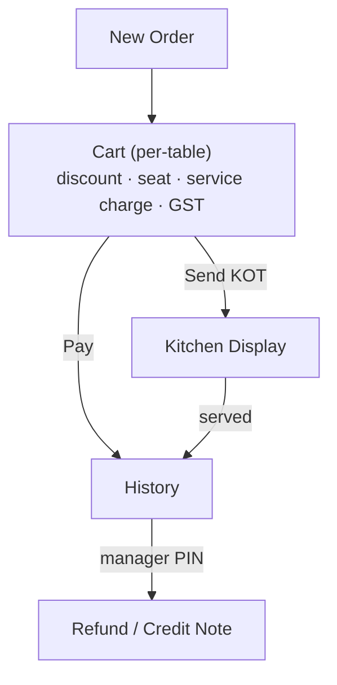
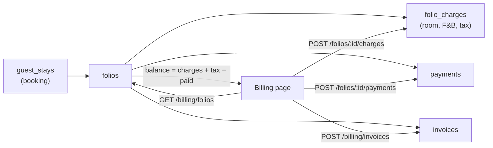
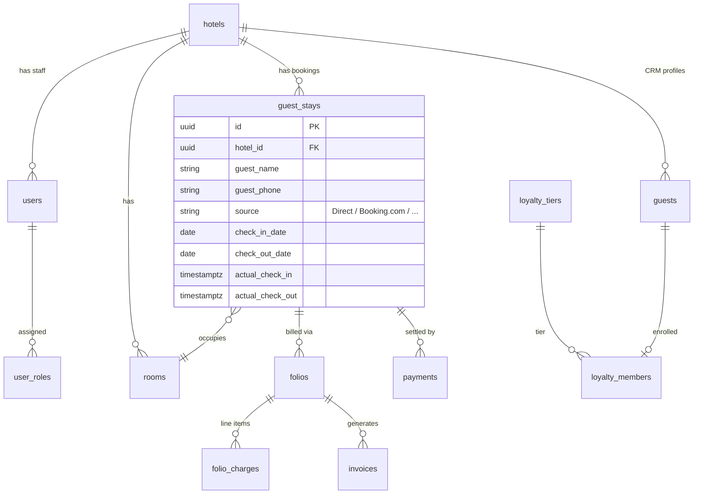
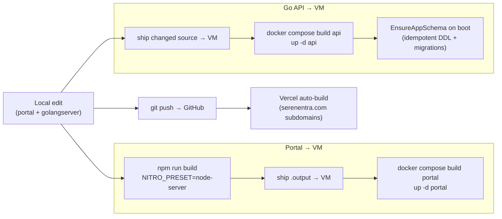

# Serenentra — Platform Architecture & Flow

> **Serenentra** is a multi-tenant hotel PMS + POS delivered as SaaS (formerly MHMS).
> This document maps the **target architecture** and flags, for each part, whether
> it is **✅ Built**, **🟡 Partial**, or **⛔ Pending** in the current system.
>
> Diagrams are [Mermaid](https://mermaid.js.org/) — they render automatically on GitHub.

**Status legend:** ✅ Built & live · 🟡 Partial / in progress · ⛔ Planned / manual today

---

## 1. Platform Topology

Serenentra is one public site plus three application surfaces, all backed by a
single multi-tenant API.

| Surface | Domain pattern | Audience | Status |
|---|---|---|---|
| Public website | `serenentra.com` | Visitors (marketing, pricing, demo, login) | ✅ |
| Super Admin console | `superadmin.serenentra.com` | Platform operator (you) | ✅ |
| Per-hotel staff portals | `<hotel>.serenentra.com` (e.g. `taj.serenentra.com`) | Hotel staff, all plans | ✅ |
| Per-hotel guest portals | `<hotel>client.serenentra.com` | Hotel guests, **premium only** | ⛔ |

---

## 2. Multi-Tenant Runtime

A request flows through Nginx, gets resolved to a tenant, is served by the Go
API, and reads/writes that tenant's **isolated database**.

**How tenant resolution actually works (important nuance):**
- The **subdomain** identifies the hotel at **login** — the API checks that the
  signing-in user's `hotel_id` matches the hotel that owns the subdomain.
- For every authenticated request thereafter, routing to the correct database is
  driven by the **`hotel_id` claim inside the JWT**, resolved through the
  `tenant_registry` table (cached ~30s), **not** by re-parsing the subdomain.
- So "Tenant Resolver by subdomain" is accurate at the login boundary; the
  steady-state resolver is the JWT → `tenant_registry` → connection-pool lookup. ✅

**Runtime components**

| Component | Tech | Status | Notes |
|---|---|---|---|
| Reverse proxy | Nginx (SSL via Let's Encrypt) | ✅ | Per-subdomain server blocks → API and SSR portals |
| Staff portal | TanStack Start, React 19, Nitro SSR, shadcn/ui, Tailwind v4 | ✅ | Built `NITRO_PRESET=node-server`; SSR |
| Super Admin console | TanStack Start, React 19, Nitro SSR | ✅ | Platform operator only (`platform_admin`) |
| API | Go 1.22 + Fiber | ✅ | Runs `EnsureAppSchema` + SQL migrations on boot |
| Databases | PostgreSQL 16 | ✅ | One dedicated DB per client + a shared routing/auth DB |
| Cache | Redis 7 | ✅ | Namespaced `t:{hotel_id}:*` — plan/currency/modules, dashboard cache, rate limits |
| File storage (media) | — | ⛔ | Not wired; backups land on a local volume only |

> Hosting: containers run on a single Linux VPS behind Nginx. Infra addresses,
> SSH endpoints and secrets are intentionally kept out of this public document.

---

## 3. Super Admin Console

The platform control plane. Everything needed to sell and operate the product
without touching the database or the server directly.

| Capability | Status | Notes |
|---|---|---|
| Dashboard / fleet overview | ✅ | Active clients, plan distribution, near-limit alerts |
| Client / hotel management | ✅ | Create, edit, deactivate, delete (primary tenant hard-guarded) |
| Add new client / hotel | ✅ | Name, slug, plan, currency, hotel email/phone/timezone |
| Plans & feature matrix | ✅ | Per-plan module toggles; per-tenant module overrides |
| Backups | ✅ | Per-tenant `pg_dump` → gzip → local volume + history |
| Monitoring & machine health | ✅ | Go runtime, Postgres, Redis, worker stats, VM resources |
| Security overview | ✅ | Platform operators, JWT/bcrypt/rate-limit config |
| Integrations | ✅ | Webhook / integration configuration |
| Demo leads | ✅ | Inbound demo requests from the landing page |
| Subscription & billing (MRR/ARR) | ⛔ | Planned — no billing dashboard yet |
| DNS & subdomain management | ⛔ | Planned — subdomain/DNS setup is manual today |
| Usage & analytics | 🟡 | Monitoring exists; per-client business analytics planned |
| Support & helpdesk | ⛔ | Planned |
| Live client stats / impersonation / remote config | ⛔ | Planned (highest operator ROI) |

---

## 4. New Client Onboarding Flow

The 8-step provisioning sequence, with what's automated today vs. manual.

| Step | Status | Implementation |
|---|---|---|
| 1. Add client | ✅ | `POST /api/platform/tenants` → `CreatePlatformTenant` |
| 2. Dedicated DB | ✅ | `Manager.Provision()` creates `{slug}_hotelops`, runs `EnsureAppSchema`, then `seedTenantDB` seeds **only** the hotel record, branding, payment config, and the initial `tenant_configs` snapshot — **no** operational content (blank-slate by design; template-seeding of rooms/menu/outlet was reversed 2026-07-02) |
| 3. Create subdomain | ⛔ | **Manual** — Nginx server block written by hand on the VM (shared vhost template) |
| 4. DNS configuration | ⛔ | **Manual** — DNS record added by hand in **GoDaddy** (the earlier Cloudflare-API integration idea was abandoned; `CLOUDFLARE_*` env keys are vestigial) |
| 5. Route configuration | ⛔ | **Manual** — Nginx reload |
| 6. System configuration | ✅ | Plan-aware branding + `tenant_configs` + module mask seeded on create |
| 7. First admin user | ✅ | Optional admin user + `platform_admin`/role rows created during step 1 |
| 8. Client ready | ✅ | Redis warmed (`plan`, `currency`); tenant routes to its dedicated DB |

> **Biggest onboarding gap:** steps 3–5 (subdomain + DNS + route) are manual.
> Automating them is the highest-ROI next build for reducing per-client setup time.

---

## 5. Data Isolation Model

**Every client gets a dedicated PostgreSQL database.** No hotel's business data
is shared with another.

| Database | Contents | Status |
|---|---|---|
| Shared routing/auth DB | `tenant_registry` (routing only), `users`, `user_roles`, `plan_tiers`, `provisioning_jobs`, `demo_requests`, `schema_migrations` | ✅ |
| Per-client DB `{slug}_hotelops` | `hotels`, `rooms`, `guests`, `guest_stays`, `folios`, `pos_orders`, `menu_categories`, `payment_settings`, `pos_outlets`, `tenant_configs`, `hotel_branding`, `tenant_modules`, + all operational tables | ✅ |

- `tenant_registry` maps `hotel_id → isolation_mode, db_name`. It is a **routing
  table**, not tenant data.
- Login is a public route (before tenant middleware), so it always queries the
  shared DB; a hotel's staff/guest apps then route to that hotel's dedicated DB.
- Redis keys are namespaced `t:{hotel_id}:*` — no cross-tenant collisions.

---

## 6. Authentication & Roles

JWT-based. Access token (15 min) + refresh token (7 days) in `localStorage`;
`apiFetch` transparently refreshes once on a `401`.

**Roles** (`user_roles`): `super_admin`, `hotel_admin`, `front_desk`,
`housekeeping`, `accountant`, `fnb`, `guest`, plus a platform-wide
`platform_admin` flag. Platform endpoints (`/api/platform/*`) each enforce
`requirePlatformAdmin` on the JWT. ✅

---

## 7. Feature Map — Pages ↔ API (Live vs. Demo)

The staff portal has ~24 routes. Each page either reads the **live API** or falls
back to an in-browser **demo store** (Zustand `mhms-store`) so it renders even
when signed out. Pages show a **"Live data" / "Demo data"** badge.

| Area | Status |
|---|---|
| Auth, JWT, roles | ✅ Live |
| Dashboard, Reservations, Front Desk, CRM, Housekeeping | ✅ Live |
| Billing (folios / charges / payments / invoices), Users | ✅ Live |
| POS orders (`pos_orders`, JSONB line items, Redis-cached) | ✅ Live |
| POS KDS stages, split/merge, refunds, tax depth | 🟡 Client-side UI over the persisted order |
| Reports, Night Audit, Revenue, Channel Mgr, Booking Engine | 🟡 Backend endpoints exist, page still on demo store |
| Inventory, Procurement, Maintenance, Properties, Admin | 🟡 Demo store |

---

## 8. Reservation Lifecycle (live)

The New Reservation wizard persists to the API, including **phone** and
**booking source** (Direct / Booking.com / Expedia / MakeMyTrip / Goibibo /
Agoda / Airbnb / Walk-in / Phone / Corporate).

Status is **derived** server-side from timestamps
(`upcoming → pending_checkin → in_house → checked_out`).

---

## 9. POS Order Flow (live · Redis-cached)

POS orders persist to `pos_orders` (JSONB line items) via `/api/pos/orders` when
signed in, with a demo-store fallback offline. The order list is cached in Redis
(15s TTL, invalidated on every write) and polled for near-real-time KDS.

POS order state: `Open → Sent → Paid`. KDS stages and refund records are tracked
in component state keyed by order id. 🟡

---

## 10. Billing Flow (live)

Payments attach to the booking (`guest_stay_id`); with multiple folios,
completed payments are attributed to the earliest (canonical) folio.

---

## 11. Core Data Model (key tables)

Every tenant-scoped table carries `hotel_id`.

---

## 12. Build & Deploy Pipeline

- **Backend:** source shipped to the VM; Go compiles inside Docker; migrations run
  on boot. Make all migration DDL idempotent (`IF NOT EXISTS`, `ON CONFLICT`); never
  put `;` inside a `--` comment (the migration runner splits on `;`).
- **Frontend:** push to GitHub (Vercel builds the `serenentra.com` subdomains) and
  ship the built `.output/` to the VM.

---

## 13. Status Summary — Target vs. Built

| Layer | Target (diagram) | Reality | Status |
|---|---|---|---|
| Dedicated DB per hotel | Yes | Provisioned per client (`{slug}_hotelops`) | ✅ |
| Tenant resolution | By subdomain | Subdomain at login; JWT `hotel_id` at runtime | ✅ |
| Nginx reverse proxy | Yes | Per-subdomain → one API | ✅ |
| Onboarding: add client, create DB, config, admin user | Automated | Automated | ✅ |
| Onboarding: subdomain, DNS, route | Automated | **Manual** | ⛔ |
| Super Admin: dashboard, clients, plans, monitoring, backups, delete | Yes | Built | ✅ |
| Super Admin: billing, DNS mgmt, helpdesk, analytics | Yes | Not built | ⛔ |
| Guest portal (`<hotel>client.serenentra.com`, premium) | Yes | Not built | ⛔ |
| File storage (documents / media) | Yes | Only local backup volume | ⛔ |
| Backup & monitoring | Yes | Built (local); external upload pending | 🟡 |
| Data isolation, RBAC, multi-tenant | Yes | Enforced (dedicated DB + `hotel_id` scoping) | ✅ |

**Highest-ROI next builds:** (1) automate subdomain + DNS + route (onboarding 3–5);
(2) Super Admin live client stats + impersonation + remote config; (3) billing / MRR
dashboard; (4) premium guest portal.

---
*Keep this document in sync with feature and infrastructure changes. No IPs, SSH
endpoints, or secrets — this file is committed to a public repository.*
